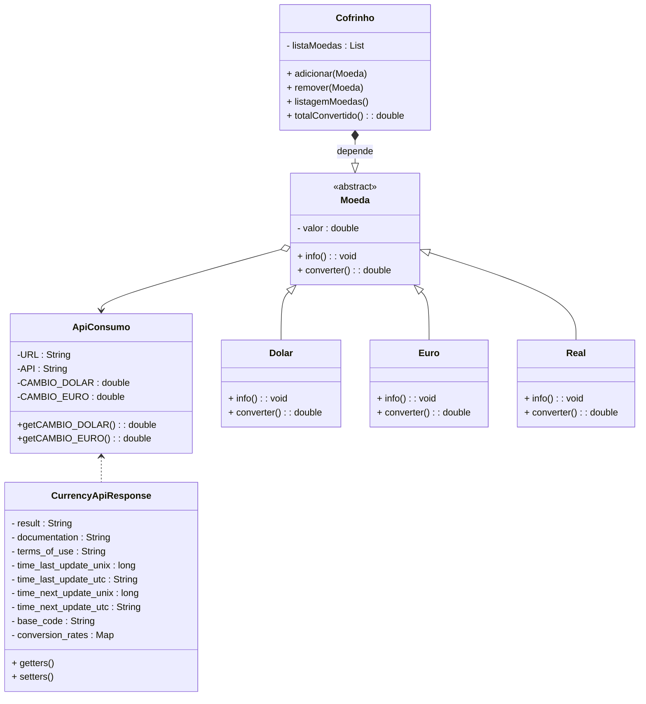

---
# CofrinhoTrabalho
Projeto desenvolvido para entrega do trabalho do curso POO de minha graduação.

# 💵💰 **Cofrinho - Gestão financeira**  

[](https://www.oracle.com/java/technologies/javase-downloads.html)  
[](https://spring.io/projects/spring-boot)  
[](LICENSE)

Uma API RESTful desenvolvida em **Java 17** com **Spring Boot 3** para gerenciamento de informações bancárias como clientes, funcionalidades, cartões e notícias. Este projeto é um estudo prático no contexto do **DIO Claro Bootcamp 2024**.

---

## 🎯 **Objetivo do Projeto**

Este projeto tem como objetivo:
- Desenvolver habilidades práticas em **Java Web**.
- Aplicar conceitos fundamentais de **RESTful APIs**.
- Gerenciar dados de um sistema bancário fictício.

---

## ⚙️ **Funcionalidades**

### **Entidades e Recursos**
1. **Clientes**:
   - Criar um cliente com:
     - Nome
     - Agência
     - Número da conta
2. **Funcionalidades**:
   - Cadastrar uma funcionalidade com:
     - Nome
     - Ícone
3. **Cartões**:
   - Registrar um cartão com:
     - Número
     - Limite disponível
4. **Notícias**:
   - Adicionar notícias com:
     - Título
     - Ícone ilustrativo

---

## 🛠️ **Tecnologias Utilizadas**

- **Java 17**  
- **Spring Boot 3**  
- **Maven/Gradle** para gerenciamento de dependências  
- **JPA/Hibernate** para persistência de dados  
- **Banco de Dados H2** (ambiente de teste, opcional para produção)  
- **Thymeleaf** (futuro uso para views, se necessário)  
- Ferramentas de teste como **Postman** ou **Swagger**.

---

## 🏗️ **Estrutura do Projeto**

```plaintext
src
├── main
│   ├── java
│   │   └── com.example.api
│   │       ├── controllers
│   │       ├── entities
│   │       ├── services
│   │       ├── repositories
│   │       └── config
│   └── resources
│       ├── application.yml
│       └── data.sql
└── test
    └── java
        └── com.example.api
```


---

## 🚀 **Como Executar**

1. **Clone o repositório**:
   ```bash
   git clone https://github.com/seu-usuario/seu-repositorio.git
   cd seu-repositorio
   ```

2. **Configure o ambiente**:
   - Certifique-se de ter o **Java 17** e **Gradle** instalados.

3. **Execute a aplicação**:
   ```bash
   ./gradlew bootRun
   ```

4. **Acesse os Endpoints**:
   - Base URL: `http://localhost:8080`
   - Use ferramentas como **Postman** para testar.

---

## 🧪 **Exemplo de Uso**

### **Cadastro de Cliente**
- **Endpoint:** `POST /clientes`  
- **Payload de Exemplo:**
  ```json
  {
      "nome": "João da Silva",
      "agencia": "1234",
      "numeroConta": "56789-0"
  }
  ```

### **Cadastro de Funcionalidade**
- **Endpoint:** `POST /funcionalidades`  
- **Payload de Exemplo:**
  ```json
  {
      "nome": "Transferências",
      "icone": "transfer_icon.png"
  }
  ```

---

## 📂 **To-Do List**

- [x] Implementar CRUD de clientes.  
- [x] Criar endpoints para funcionalidades.  
- [ ] Adicionar autenticação e segurança com Spring Security.  
- [ ] Criar testes unitários e de integração.

---

## 📝 **Licença**

Este projeto está sob a licença [MIT](LICENSE). Sinta-se à vontade para usá-lo, modificá-lo e distribuí-lo como preferir. 😊

---

## 📞 **Contato**

- **Autor:** Seu Nome  
- **E-mail:** seu.email@example.com  
- **GitHub:** [seu-usuario](https://github.com/seu-usuario)  
- **LinkedIn:** [Seu Perfil](https://linkedin.com/in/seu-perfil)

---

Caso queira alterar algo ou adicionar detalhes extras, só avisar!
