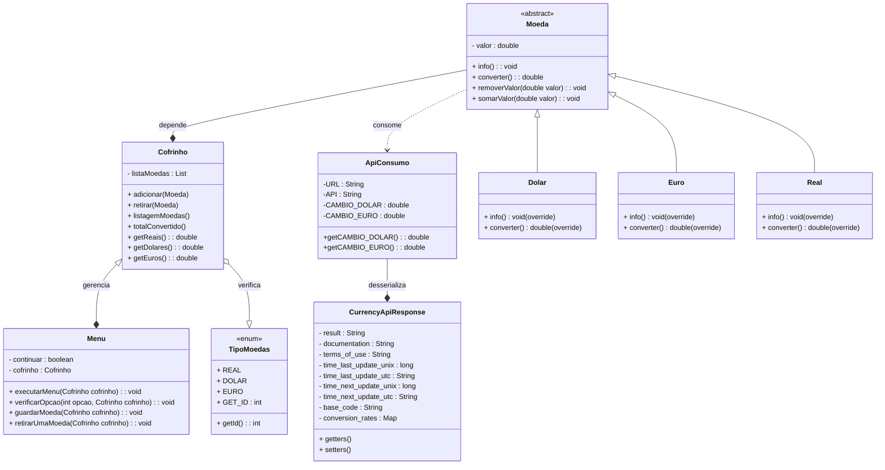

---
# CofrinhoTrabalho
Projeto desenvolvido para entrega do trabalho do curso Programação Orientada a Objetos de minha graduação.

# 💵 **Cofrinho - Gestão financeira** 💰

[](https://www.oracle.com/java/technologies/javase-downloads.html)
[](https://maven.apache.org)

[](LICENSE)


Um sistema desenvolvido com **Java 17** e gerenciado com **Apache Maven** que interage com o usuário por meio do terminal e fazendo o controle financeiro de entrada/saída de moedas e sua conversão em real. O projeto foi incrementado com consumo de api para conversão monetário fazendo uso da dependência **Gson**.

---

## 🎯 **Objetivo do Projeto**

Este projeto tem como objetivo:
- Desenvolver habilidades práticas em **Java**.
- Apronfundar a **lógica** de programação.
- Revisar conceitos e paradigmas de **POO**.
- Aplicar conceitos fundamentais de **HTTP**.
- Gerenciar dados de um sistema **financeiro**.
- Praticar desserialização de **json**.

---

## ⚙️ **Funcionalidades**

### **Entidades e Recursos**
1. **Cofrinho**:
   - Cria uma lista de moedas e gerenciar o fluxo de entrada e saída.
2. **Moeda**:
   - Classe abstrata que reutiliza códigos e abstrai conceitos físicos e possui subclasses:
     - Real
     - Dolar
     - Euro
3. **Menu**:
   - Interage com o usuário por meio do console e gerencia o cofrinho.
4. **ApiConsumo**:
   - Consume uma API externa de taxas de câmbio para obter as taxas de conversão das moedas e as armazena:
     - Câmbio de dolar para real: CAMBIO_DOLAR;
     - Câmbio de euro para real: CAMBIO_EURO;
5. **CurrencyApiResponse**:
   - Armazena os respectivos valores desserializados da ApiConsumo e serve de base para realizar o consumo.
     

---

## 🛠️ **Tecnologias Utilizadas**

- **Java 17**  
- **Maven** para gerenciamento de dependências.
- **Gson** para desserialização de json.
- Ferramentas de teste como **Postman**.

---

## 🏗️ **Estrutura do Projeto**

```plaintext
src
└── main
    ├── java
    │   └── edu
    |        └── luc
    |            ├── model 
    │            ├── service
    └── resources
       └── application.properties
```


---

## 🚀 **Como Executar**


1. **Configure o ambiente**:
- **Java Development Kit (JDK)** instalado (versão 11 ou superior, dependendo do seu projeto).
- **Apache Maven** instalado (recomenda-se a versão mais recente)

2. **Clone o repositório**:
   ```bash
   git clone https://github.com/Luc033/CofrinhoTrabalho.git
   cd CofrinhoTrabalho
   ```
   
3. **Compile o projeto no CMD**:
   Para garantir que todas as dependências estejam configuradas corretamente, execute:
   ```bash
   mvn clean install
   ```
   
3. **Execute o projeto**:
   No diretório raiz do projeto, digite:
   ```bash
   mvn exec:java
   ```

4. **Saída esperada**:
   O programa será executado e apresentará o menu inicial no terminal:
```bash
<===================M=E=N=U===================>
 |                                           |
 |  1 -- Adicionar moedas no cofrinho        |
 |  2 -- Retirar moedas do cofrinho          |
 |  3 -- Listar todas as moedas do cofrinho  |
 |  4 -- Converter todas as moedas para real |
 |                                           |
 |  0 -- Sair                                |
<=============================================>
```


---

## 📝 **Licença**

Este projeto está sob a licença [MIT](LICENSE). Sinta-se à vontade para usá-lo, modificá-lo e distribuí-lo como preferir. 😊

---

## 📞 **Contato**

- **Autor:** Lucas Melo  
- **E-mail:** lucasrm33.contato@gmail.com
- **GitHub:** [Luc033](https://github.com/Luc033)  
- **LinkedIn:** [Lucas Melo](https://linkedin.com/in/lucas-melo-dev)

---
