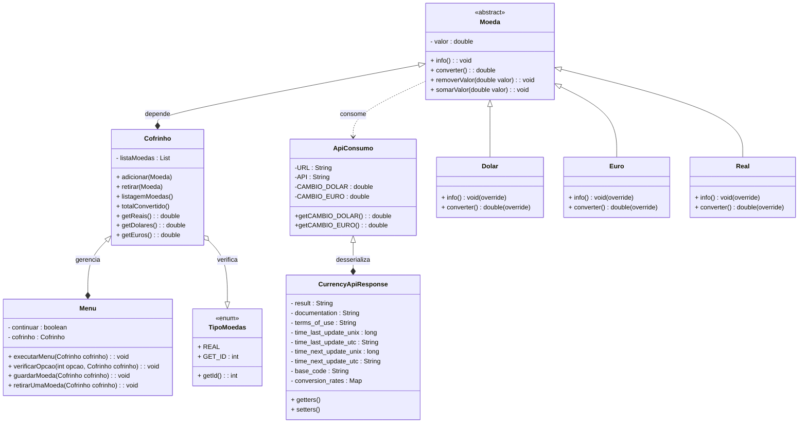

---
# CofrinhoTrabalho
Projeto desenvolvido para entrega do trabalho do curso Programação Orientada a Objetos de minha graduação.

# üíµ **Cofrinho - Gest√£o financeira** üí∞

[](https://www.oracle.com/java/technologies/javase-downloads.html)
[](https://maven.apache.org)

[](LICENSE)


Um sistema desenvolvido com **Java 17** e gerenciado com **Apache Maven** que interage com o usuário por meio do terminal e fazendo o controle financeiro de entrada/saída de moedas e sua conversão em real. O projeto foi incrementado com consumo de api para conversão monetário fazendo uso da dependência **Gson**.

---

## 🎯 **Objetivo do Projeto**

Este projeto tem como objetivo:
- Desenvolver habilidades pr√°ticas em **Java**.
- Apronfundar a **lógica** de programação.
- Revisar conceitos e paradigmas de **POO**.
- Aplicar conceitos fundamentais de **HTTP**.
- Gerenciar dados de um sistema **financeiro**.
- Praticar desserialização de **json**.

---

## ⚙️ **Funcionalidades**

### **Entidades e Recursos**
1. **Cofrinho**:
   - Cria uma lista de moedas e gerenciar o fluxo de entrada e saída.
2. **Moeda**:
   - Classe abstrata que reutiliza códigos e abstrai conceitos físicos e possui subclasses:
     - Real
     - Dolar
     - Euro
3. **Menu**:
   - Interage com o usu√°rio por meio do console e gerencia o cofrinho.
4. **ApiConsumo**:
   - Consume uma API externa de taxas de c√¢mbio para obter as taxas de convers√£o das moedas e as armazena:
     - C√¢mbio de dolar para real: CAMBIO_DOLAR;
     - C√¢mbio de euro para real: CAMBIO_EURO;
5. **CurrencyApiResponse**:
   - Armazena os respectivos valores desserializados da ApiConsumo e serve de base para realizar o consumo.
     

---

## 🛠️ **Tecnologias Utilizadas**

- **Java 17**  
- **Maven** para gerenciamento de dependências.
- **Gson** para desserialização de json.
- Ferramentas de teste como **Postman**.

---

## 🏗️ **Estrutura do Projeto**

```plaintext
src
└── main
    ├── java
    │   └── edu
    |        └── luc
    |            ├── model 
    │            ├── service
    └── resources
       └── application.properties
```

```mermaid
classDiagram
    class Cofrinho {
        - listaMoedas : List<Moeda>
        + adicionar(Moeda)
        + retirar(Moeda)
        + listagemMoedas()
        + totalConvertido()
        + getReais() : double
        + getDolares() : double
        + getEuros() : double
    }
    class ApiConsumo {
      -URL : String
      -API : String
      -CAMBIO_DOLAR : double 
      -CAMBIO_EURO  : double
      +getCAMBIO_DOLAR() : double
      +getCAMBIO_EURO() : double
    }
    class CurrencyApiResponse{
      - result : String
      - documentation : String
      - terms_of_use : String 
      - time_last_update_unix : long
      - time_last_update_utc : String
      - time_next_update_unix : long
      - time_next_update_utc : String
      - base_code : String
      - conversion_rates : Map<String, Double>
      + getters()
      + setters()
    }

    class Moeda {
        <<abstract>>
        - valor : double
        + info() : void
        + converter() : double
        + removerValor(double valor) : void
        + somarValor(double valor) : void
    }

    class Dolar {
        + info() : void (override)
        + converter() : double (override)
    }

    class Euro {
        + info() : void (override)
        + converter() : double (override)
    }

    class Real {
        + info() : void (override)
        + converter() : double (override)
    }

   class Menu {
      - continuar : boolean
      - cofrinho : Cofrinho
      + executarMenu(Cofrinho cofrinho) : void
      + verificarOpcao(int opcao, Cofrinho cofrinho) : void
      + guardarMoeda(Cofrinho cofrinho) : void
      + retirarUmaMoeda(Cofrinho cofrinho) : void
   }

   class TipoMoedas{
      <<enum>>
      + REAL
      + GET_ID : int
      + getId() : int
   }
   
   Cofrinho <|--* Menu : gerencia
   Moeda <|--* Cofrinho : depende
   Moeda ..> ApiConsumo : consome
   Moeda <|-- Dolar
   Moeda <|-- Euro
   Moeda <|-- Real
   Cofrinho o--|> TipoMoedas : verifica
   ApiConsumo <|--* CurrencyApiResponse : desserializa
```

---

## üöÄ **Como Executar**

1. **Clone o repositório**:
   ```bash
   git clone https://github.com/Luc033/CofrinhoTrabalho.git
   cd CofrinhoTrabalho
   ```

2. **Configure o ambiente**:
   - Certifique-se de ter o **Java 17** ou superior.

3. **Execute a aplicação no CMD**:
   No diretório da classe Main.java
   ```bash
   javac Main.java
   java Main
   ```
---

## 📝 **Licença**

Este projeto está sob a licença [MIT](LICENSE). Sinta-se à vontade para usá-lo, modificá-lo e distribuí-lo como preferir. 😊

---

## üìû **Contato**

- **Autor:** Lucas Melo  
- **E-mail:** lucasrm33.contato@gmail.com
- **GitHub:** [Luc033](https://github.com/Luc033)  
- **LinkedIn:** [Lucas Melo](https://linkedin.com/in/lucas-melo-dev)

---
